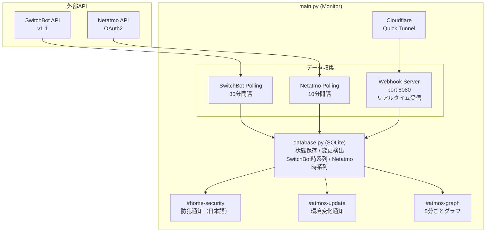

# SwitchBot & Netatmo Hub Monitor

SwitchBotデバイスとNetatmo Weather Stationの状態を監視し、変化があればSlackに通知するツールです。


## 特徴

- **マルチプラットフォーム監視**: SwitchBotとNetatmoを一元管理
- **ハイブリッド監視**: ポーリング方式とWebhook方式を組み合わせ
- **複数Slackチャンネル対応**: 防犯/環境更新/グラフを別チャンネルに通知
- **日本語通知**: セキュリティイベントは「解錠されました」などわかりやすく通知
- **5分ごとのグラフレポート**: 温湿度・CO2・気圧・騒音を屋外/屋内で分けてグラフ化
- **Quick Tunnel対応**: ドメイン不要でWebhook受信可能（URLは自動更新）
- **JST表示**: グラフの時間軸は日本時間

## 対応デバイス

### SwitchBot
- 温湿度計（Meter, MeterPlus, MeterPro）
- CO2センサー（MeterPro CO2）
- 防水温湿度計（Outdoor Meter）
- Hub 2
- スマートロック
- 開閉センサー
- モーションセンサー
- ドアベル

### Netatmo Weather Station
- メインステーション（温度・湿度・CO2・気圧・騒音）
- 屋外モジュール（温度・湿度）
- 追加室内モジュール（温度・湿度・CO2）

## Slack通知チャンネル

| チャンネル | 用途 | 通知例 |
|-----------|------|--------|
| `#home-security` | 防犯デバイス（ロック、開閉センサー等） | 🔓 ロックPro 24が解錠されました |
| `#atmos-update` | 温湿度・CO2の変化（Webhook） | CO2センサー 3A: 22.7°C / 51% / 1013ppm |
| `#atmos-graph` | 5分ごとのグラフレポート | 屋外/屋内の温度・湿度・CO2グラフ |

## 必要要件

- Python 3.7以上
- requests ライブラリ
- SwitchBot Hub (Hub Mini, Hub 2など)
- cloudflared (Webhook使用時)
- Netatmo Weather Station（オプション）

## クイックスタート

### 1. SwitchBot API認証情報の取得

1. SwitchBotアプリを開く (v6.14以上)
2. **プロフィール** > **設定** > **アプリバージョン** を10回タップ
3. **開発者オプション** が表示される
4. **トークン** と **シークレットキー** を取得

### 2. Netatmo API認証情報の取得（オプション）

#### ステップ1: Netatmoアプリの作成

1. [Netatmo Connect](https://dev.netatmo.com/) にアクセス
2. **Create an App** でアプリを作成
   - App Name: 任意の名前（例: `Home Monitor`）
   - Description: 任意の説明
   - Data Protection Officer: 自分の名前とメールアドレス
3. **Client ID** と **Client Secret** をメモ

#### ステップ2: 認証ヘルパーでリフレッシュトークンを取得

```bash
# 認証ヘルパーを実行
python netatmo_auth.py
```

対話形式で案内されます:
1. Client ID を入力
2. Client Secret を入力
3. ブラウザが自動で開く → Netatmoにログイン → 許可
4. リフレッシュトークンが表示される

```
$ python netatmo_auth.py
============================================================
Netatmo OAuth2 認証ヘルパー
============================================================

Client ID を入力: xxxxxxxxxxxxxxxxxxxxxxxx
Client Secret を入力: xxxxxxxxxxxxxxxxxxxxxxxx

ブラウザで以下のURLを開きます...

認可コードを取得しました!

トークン取得成功!

Refresh Token: xxxxxxxxxxxxxxxxxxxxxxxx

============================================================
config.json に以下を追加してください:
============================================================
{
    "netatmo": {
        "enabled": true,
        "client_id": "xxxxxxxx",
        "client_secret": "xxxxxxxx",
        "refresh_token": "xxxxxxxx",
        ...
    }
}
```

> **Note**: 認証情報は `netatmo_credentials.json` に保存することもできます（スクリプト内で選択可能）

### 3. Slack Incoming Webhookの設定

3つのチャンネル用にWebhook URLを取得:

1. [Slack API](https://api.slack.com/apps) でアプリを作成
2. **Incoming Webhooks** を有効化
3. 以下のチャンネルそれぞれにWebhook URLを作成:
   - `#home-security` (防犯通知)
   - `#atmos-update` (環境変化通知)
   - `#atmos-graph` (グラフレポート)

### 4. cloudflaredのインストール（Raspberry Pi）

```bash
# ARM版をダウンロード
wget https://github.com/cloudflare/cloudflared/releases/latest/download/cloudflared-linux-arm
sudo mv cloudflared-linux-arm /usr/local/bin/cloudflared
sudo chmod +x /usr/local/bin/cloudflared

# 確認
cloudflared --version
```

### 5. 設定ファイルの作成

```bash
cp config.json.example config.json
```

`config.json` を編集:

```json
{
    "switchbot": {
        "token": "YOUR_SWITCHBOT_API_TOKEN",
        "secret": "YOUR_SWITCHBOT_API_SECRET"
    },
    "netatmo": {
        "enabled": true,
        "client_id": "YOUR_NETATMO_CLIENT_ID",
        "client_secret": "YOUR_NETATMO_CLIENT_SECRET",
        "refresh_token": "YOUR_NETATMO_REFRESH_TOKEN",
        "credentials_file": null,
        "interval_seconds": 600
    },
    "slack": {
        "channels": {
            "home_security": "https://hooks.slack.com/services/YOUR/SECURITY/WEBHOOK",
            "atmos_update": "https://hooks.slack.com/services/YOUR/ATMOS/WEBHOOK",
            "atmos_graph": "https://hooks.slack.com/services/YOUR/GRAPH/WEBHOOK"
        },
        "enabled": true,
        "notify_startup": true,
        "notify_errors": true
    },
    "monitor": {
        "interval_seconds": 1800,
        "ignore_devices": ["テープライト BA", "ハブミニ DC"],
        "polling_devices": ["CO2センサー", "温湿度計", "ハブ２"]
    },
    "webhook": {
        "enabled": true,
        "port": 8080,
        "path": "/switchbot/webhook"
    },
    "cloudflare_tunnel": {
        "enabled": true,
        "hostname": null,
        "config_path": null
    },
    "database": {
        "path": "device_states.db",
        "history_days": 30,
        "sensor_data_days": 7,
        "netatmo_data_days": 7
    },
    "graph_report": {
        "enabled": true,
        "interval_minutes": 5
    },
    "logging": {
        "level": "INFO",
        "file": null
    }
}
```

### 6. 実行

```bash
pip install requests
python main.py
```

## 設定項目

### switchbot

| 項目 | 説明 |
|------|------|
| `token` | SwitchBot APIトークン |
| `secret` | SwitchBot APIシークレットキー |

### netatmo

| 項目 | 説明 |
|------|------|
| `enabled` | Netatmo監視の有効/無効 |
| `client_id` | Netatmoアプリのクライアントid |
| `client_secret` | Netatmoアプリのクライアントシークレット |
| `refresh_token` | OAuth2リフレッシュトークン |
| `credentials_file` | リフレッシュトークン永続化ファイルパス（オプション） |
| `interval_seconds` | ポーリング間隔（秒）。デフォルト600秒（10分） |

**credentials_file について:**

Netatmoはリフレッシュトークンが定期的に更新されます。`credentials_file` を指定すると、更新されたトークンを自動で保存します。指定しない場合、長期間実行していると認証が切れる可能性があります。

### slack

| 項目 | 説明 |
|------|------|
| `channels.home_security` | 防犯通知用Webhook URL |
| `channels.atmos_update` | 環境変化通知用Webhook URL |
| `channels.atmos_graph` | グラフレポート用Webhook URL |
| `enabled` | Slack通知の有効/無効 |
| `notify_startup` | 起動時に通知 |
| `notify_errors` | エラー発生時に通知 |

### monitor

| 項目 | 説明 |
|------|------|
| `interval_seconds` | SwitchBotポーリング間隔（秒）。デフォルト1800秒（30分） |
| `ignore_devices` | 監視しないデバイス名のリスト（部分一致） |
| `polling_devices` | ポーリングで監視するデバイス名のリスト（部分一致） |

**デバイスの振り分けロジック:**
1. `ignore_devices` に一致 → 無視
2. `polling_devices` に一致 → ポーリング監視（グラフ用データ蓄積）
3. どちらにも一致しない → Webhook監視

### webhook

| 項目 | 説明 |
|------|------|
| `enabled` | Webhookサーバーの有効/無効 |
| `port` | リッスンポート（デフォルト8080） |
| `path` | Webhookエンドポイントパス |

### cloudflare_tunnel

| 項目 | 説明 |
|------|------|
| `enabled` | Cloudflare Tunnelの有効/無効 |
| `hostname` | トンネルのホスト名（`null`でQuick Tunnel） |
| `config_path` | cloudflared設定ファイルパス（`null`でQuick Tunnel） |

**Quick Tunnel モード（推奨）:**

`hostname` と `config_path` の両方を `null` にすると、Cloudflare Quick Tunnelを使用します。

- ドメイン不要、認証不要で即座に使える
- 起動ごとにランダムなURL（`xxx.trycloudflare.com`）が生成される
- **自動クリーンアップ**: 起動時に古いWebhook URLをSwitchBotから自動削除し、新しいURLを登録

### database

| 項目 | 説明 |
|------|------|
| `path` | SQLiteデータベースファイルパス |
| `history_days` | 状態変更履歴の保持日数 |
| `sensor_data_days` | SwitchBotセンサー時系列データの保持日数（デフォルト7日） |
| `netatmo_data_days` | Netatmo時系列データの保持日数（デフォルト7日） |

### graph_report

| 項目 | 説明 |
|------|------|
| `enabled` | グラフレポートの有効/無効 |
| `interval_minutes` | レポート送信間隔（分）。デフォルト5分 |

### logging

| 項目 | 説明 |
|------|------|
| `level` | ログレベル (DEBUG, INFO, WARNING, ERROR) |
| `file` | ログファイルパス（`null`でコンソールのみ） |

## グラフレポート機能

5分ごとに `#atmos-graph` チャンネルへグラフ付きレポートを送信します。

### 生成されるグラフ（5種類）

| グラフ | 内容 |
|-------|------|
| 🌳 屋外 温度 | 屋外センサーの温度推移 |
| 🌳 屋外 湿度 | 屋外センサーの湿度推移 |
| 🏠 屋内 温度 | 室内センサーの温度推移（複数デバイス色分け） |
| 🏠 屋内 湿度 | 室内センサーの湿度推移（複数デバイス色分け） |
| 🏠 CO2濃度 | 室内のCO2推移（1000ppm/1500ppmしきい値ライン付き） |

### デバイス名のプレフィックス

グラフでは、デバイスのソースがわかるようにプレフィックスが付きます：

| プレフィックス | ソース |
|--------------|--------|
| `[SB]` | SwitchBot |
| `[NA]` | Netatmo |

### 屋外センサーの判定

**SwitchBot:** デバイス名に以下のキーワードが含まれる場合、屋外センサーとして扱います：
- `防水温湿度計`
- `屋外`
- `Outdoor`

**Netatmo:** モジュールタイプが `NAModule1`（屋外モジュール）の場合、自動的に屋外として判定されます。

### Netatmo固有の計測値

Netatmoセンサーはサマリーで以下の追加情報を表示します：
- **気圧（hPa）**: メインステーションのみ
- **騒音（dB）**: メインステーションのみ

### タイムゾーン

グラフの横軸は **JST（日本標準時）** で表示されます。

## 防犯通知（日本語）

`#home-security` チャンネルには以下のような日本語通知が送信されます：

| デバイス | 通知例 |
|---------|--------|
| スマートロック | 🔓 ロックPro 24が解錠されました / 🔒 施錠されました |
| 開閉センサー | 🚪 開閉センサー3が開きました / 閉まりました |
| モーションセンサー | 👁 動きを検知しました |
| ドアベル | 🔔 テレビドアホン 30が押されました |

## アーキテクチャ



## Supervisorでサービス化

`/etc/supervisor/conf.d/switchbot-monitor.conf`:

```ini
[program:switchbot-monitor]
command=/usr/bin/python3 /home/pi/switchbot-hub/main.py
directory=/home/pi/switchbot-hub
user=pi
autostart=true
autorestart=true
stdout_logfile=/var/log/switchbot-monitor.log
stderr_logfile=/var/log/switchbot-monitor-error.log
```

```bash
sudo supervisorctl reread
sudo supervisorctl update
sudo supervisorctl start switchbot-monitor
```

## API制限について

### SwitchBot
- **1日10,000リクエスト** の制限
- Webhookはサーバー側からのPush通知なのでAPI制限にカウントされない
- ポーリング対象を減らせばAPI使用量を大幅に削減可能

### Netatmo
- **APIリクエスト制限あり**（公式ドキュメント参照）
- デフォルト10分間隔でのポーリングを推奨
- アクセストークンは3時間で期限切れ（自動更新）

## ファイル構成

```
switchbot-hub/
├── main.py                 # メインエントリーポイント
├── switchbot_api.py        # SwitchBot API v1.1クライアント
├── netatmo_api.py          # Netatmo Weather Station APIクライアント
├── netatmo_auth.py         # Netatmo OAuth2認証ヘルパー
├── database.py             # SQLite状態管理・時系列データ
├── slack_notifier.py       # Slack通知（複数チャンネル対応）
├── webhook_server.py       # HTTPサーバー（Webhook受信）
├── cloudflare_tunnel.py    # Cloudflare Tunnel管理
├── chart_generator.py      # QuickChart.ioでグラフ生成
├── config.json.example     # 設定サンプル
└── config.json             # 設定ファイル（要作成）
```

## ライセンス

MIT
